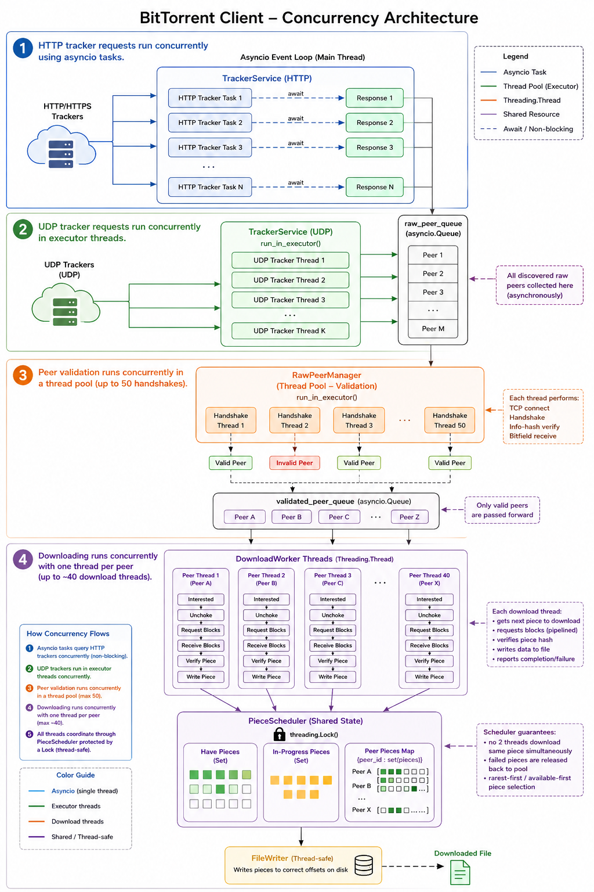

# FluxTorrent v1 (v1_threaded/) : Threaded BitTorrent Client Architecture



## Pipeline Flow

```
Tracker Services (async, re-announce every 5 min)
    ↓ (raw peers)
Raw Peer Manager (50 handshake threads)
    ↓ (validated peers)
Validated Peer Manager
    ↓ (one peer per free slot)
Download Pool in main.py (up to 40 threads, refilled continuously)
    ↓ (asks for a piece)
Piece Scheduler (rarest-first + endgame)
    ↓ (verified pieces)
File Writer
```

Everything runs at the same time: peers keep arriving while pieces are downloading.
When a download thread exits (dead / bad peer), main.py starts a new one from the validated queue.

## Component Breakdown

### 1. **main.py** - Coordinator
- Loads torrent metadata
- **Resume**: re-hashes pieces already on disk and skips the good ones
- Runs the download pool (keeps up to 40 peer threads alive)
- Prints one progress line every 5 seconds
- Always stops threads and closes files (also on Ctrl+C)
- CLI: `python main.py file.torrent [download_dir]`

### 2. **tracker_service.py** - Peer Discovery (Async)
- HTTP/HTTPS trackers via aiohttp, UDP trackers in executor threads
- Peers are queued as soon as ONE tracker answers (slow trackers don't block)
- Re-announces every 5 minutes, sends `event=started` first
- Drops duplicates and junk addresses (port 0, 0.0.0.0)

### 3. **peer_manager.py** - Validation
- **RawPeerManager**: TCP handshake + info_hash check in its own 50-thread pool.
  Most tracker peers are dead, so this filters them before they take a download slot.
- **ValidatedPeerManager**: hands out one validated peer at a time

### 4. **piece_scheduler.py** - Download State
- Tracks downloaded / in-progress pieces and per-peer availability
- **Rarest-first**: picks the piece the fewest peers have
- **Endgame**: when all remaining pieces are already started, idle peers duplicate them
- `remove_peer()` releases a dead peer's pieces so nobody waits for them forever
- Thread-safe with one lock

### 5. **downloader.py** - Download Execution
- One thread per peer, 16 pipelined block requests
- Keeps peer availability up to date from `bitfield` / `have` messages
- Waits for unchoke again after a mid-piece choke
- 60 s limit per piece, SHA-1 check before writing, bad peers are dropped

### 6. **file_writer.py** - Disk I/O
- Single or multi-file torrents, thread-safe reads and writes across file boundaries
- Existing files are kept (resume), never truncated
- Rejects torrent paths that try to leave the download folder
- fsync on close

### 7. **protocol.py** - Wire Protocol
- Message encoding/decoding, handshake, request/piece
- Message length cap, overall unchoke deadline
- Passes other messages to a callback so the downloader decides what they mean

---

## Usage

```
python main.py torrents/test_folder.torrent [download_dir]
```

Run the same command again after a stop or crash: finished pieces are verified and skipped.

---

## Data Flow

1. **Tracker → Raw Queue** (IP:port tuples)
2. **Raw Manager validates** → Validated Queue
3. **Download pool** starts a thread for each validated peer (max 40)
4. **Worker asks Scheduler** for a piece, downloads it, checks SHA-1
5. **Worker writes** → File Writer (thread-safe)

---

## Threading Model

- **Main**: async coordinator + download pool loop
- **Tracker (UDP)**: default executor threads
- **Handshake validation**: dedicated pool of 50 threads
- **Peer workers**: 1 thread per connected peer (max 40)
- **Shared state**: Piece Scheduler and File Writer, each protected by a lock

---

## Not Done Yet

- Upload (seeding) and choking logic
- DHT and PEX peer discovery
- Magnet links
- Pipelining requests across piece boundaries / adaptive pipeline depth
- Fully asynchronous download engine
